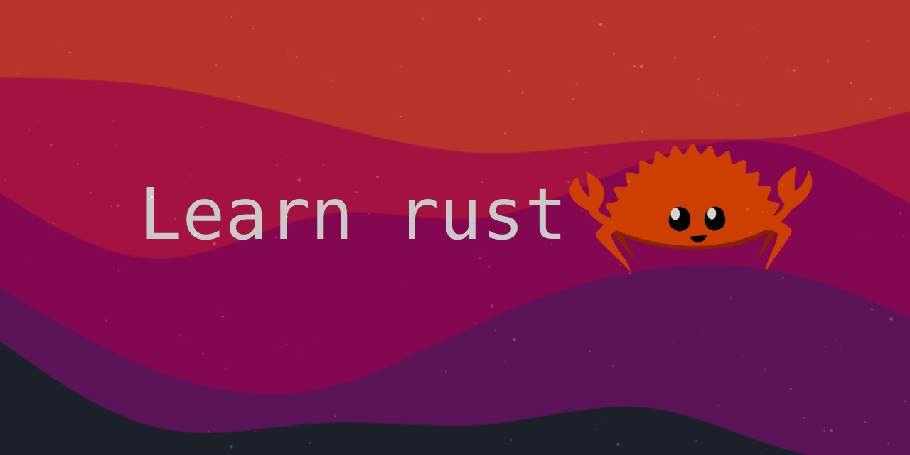
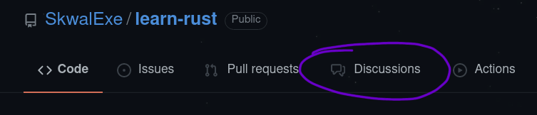

# Apprendre Rust 🦀 

Avant d'apprendre un langage de programmation, il faut comprendre les bases de la programmation, [**l'algorithmique**](https://www.youtube.com/watch?v=kk6YbA5I-Iw&list=PL2aehqZh72Lumvy4tSekr6Rzcgwn15MLI)

**Es tu anglais ? Tu preferera peut etre la version anglaise de ce cours [ici](https://github.com/SkwalExe/learn-rust)**

# Table of Contents 📚

1. [Installer Rust 🦀](https://github.com/SkwalExe/apprendre-rust/tree/main/cours/installer-rust)
    - [Linux 😎](https://github.com/SkwalExe/apprendre-rust/tree/main/cours/installer-rust#linux)
    - [Windows 💩](https://github.com/SkwalExe/apprendre-rust/tree/main/cours/installer-rust#windows)
1. [Hello world 👋](https://github.com/SkwalExe/apprendre-rust/tree/main/cours/hello-world)
    - [Declarer une fonction ](https://github.com/SkwalExe/apprendre-rust/tree/main/cours/hello-world#declarer-une-fonction)
    - [Afficher un message 💬](https://github.com/SkwalExe/apprendre-rust/tree/main/cours/hello-world#afficher-un-message)
    - [Compiler et executer un programme](https://github.com/SkwalExe/apprendre-rust/tree/main/cours/hello-world#compiler-et-executer-un-programme)

1. [Hello world avec cargo 🚢](https://github.com/SkwalExe/apprendre-rust/tree/main/cours/hello-world-cargo)
    - [Qu'est-ce que cargo?](https://github.com/SkwalExe/apprendre-rust/tree/main/cours/hello-world-cargo#quest-ce-que-cargo)
    - [Créer un projet](https://github.com/SkwalExe/apprendre-rust/tree/main/cours/hello-world-cargo#creer-un-projet)
    - [Compiler et executer un programme](https://github.com/SkwalExe/apprendre-rust/tree/main/cours/hello-world-cargo#compiler-et-executer-un-programme)
        - [Juste compiler](https://github.com/SkwalExe/apprendre-rust/tree/main/cours/hello-world-cargo#juste-compiler)
        - [Compiler et executer](https://github.com/SkwalExe/apprendre-rust/tree/main/cours/hello-world-cargo#compiler-et-executer)

1. [Les variables 📦](https://github.com/SkwalExe/apprendre-rust/tree/main/cours/les-variables)
    - [Declarer une variable](https://github.com/SkwalExe/apprendre-rust/tree/main/cours/les-variables#declarer-une-variable)
    - [Afficher une variable](https://github.com/SkwalExe/apprendre-rust/tree/main/cours/les-variables#afficher-une-variable)
    - [Modifier une variable](https://github.com/SkwalExe/apprendre-rust/tree/main/cours/les-variables#modifier-une-variable)
    - [Les variables mutables](https://github.com/SkwalExe/apprendre-rust/tree/main/cours/les-variables#les-variables-mutable)

1. [Les types de donnéees](https://github.com/SkwalExe/apprendre-rust/tree/main/cours/les-types-de-donnees/)
    - [Que sont les types de données?](https://github.com/SkwalExe/apprendre-rust/tree/main/cours/les-types-de-donnees#que-sont-les-types-de-donnees)
    - [Spécifier le type de donnée d'une variable](https://github.com/SkwalExe/apprendre-rust/tree/main/cours/les-types-de-donnees#specifier-le-type-de-donnee-dune-variable)

1. [Les structures conditionnelles 🏗](https://github.com/SkwalExe/apprendre-rust/tree/main/cours/les-structures-conditionnelles)
    - [Les operateurs de comparaison](https://github.com/SkwalExe/apprendre-rust/tree/main/cours/les-structures-conditionnelles#les-operateurs-de-comparaison)
    - [if](https://github.com/SkwalExe/apprendre-rust/tree/main/cours/les-structures-conditionnelles#if)
    - [else](https://github.com/SkwalExe/apprendre-rust/tree/main/cours/les-structures-conditionnelles#else)
    - [else if](https://github.com/SkwalExe/apprendre-rust/tree/main/cours/les-structures-conditionnelles#else-if)

1. [les boucles infinies ♾️](https://github.com/SkwalExe/apprendre-rust/tree/main/cours/les-boucles-infinies)
    - [Qu'est-ce qu'une boucle infinie?](https://github.com/SkwalExe/apprendre-rust/tree/main/cours/les-boucles-infinies#quest-ce-quune-boucle-infinie)
    - [Le mot clé loop](https://github.com/SkwalExe/apprendre-rust/tree/main/cours/les-boucles-infinies#le-mot-cle-loop)
    - [Le mot clé break](https://github.com/SkwalExe/apprendre-rust/tree/main/cours/les-boucles-infinies#le-mot-cle-break)
    - [Le mot clé continue](https://github.com/SkwalExe/apprendre-rust/tree/main/cours/les-boucles-infinies#le-mot-cle-continue)
    

# Des questions ? Envie de montrer votre projet ? 
### **Vous pouvez ouvrir l'onglet discussion 💬 en haut de l'ecran**

# final
SI vous avez des problemes, n'hesitez pas a ouvrire une issue.
# contributing
Les pull requests sont les bienvenues, pour des changements majeurs, merci d'ouvrire une issue pour expliquer ce que vous voulez changer. 
## Todo
- [ ] Ajouter une section sur le langage Rust   
- [ ] Ajouter un tuto d'installation sur macOS