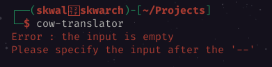
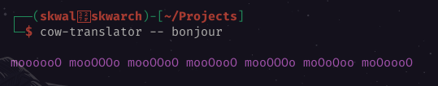

# Sommaire📚

- [Que sont les arguments de ligne de commande ❓](#que-sont-les-arguments-de-ligne-de-commande-)
- [Le module `std::env`](#le-module-stdenv)
- [Stocker les arguments dans un vecteur](#stocker-les-arguments-dans-un-vecteur)
- [Exemple](#exemple)


# Les arguments de ligne de commande 

## Que sont les arguments de ligne de commande ❓

Les arguments de ligne de commande sont les mot clés apres le nom d'un programme lorsqu'il est lancé depuis un terminal.



Ici, nous lançons le programme [cow-translator](https://github.com/SkwalExe/cow-translator) 



Ici, nous le lançons avec deux arguments de ligne de commande : 

- `--`
- `bonjour`

> ℹ️ Les differents arguments sont séparés par un espace.

## Le module `std::env`

Pour acceder aux arguments de ligne de commande depuis un programme rust, nous devons d'abord importer le module `std::env`.

```rust
use std::env;
```

Ce module nous permet d'acceder aux variables d'environment.

## Stocker les arguments dans un vecteur

Pour stocker les arguments, nous allons utiliser un vecteur.

Pour les récupérer, on utilise la methode `args` de `std::env`.

```rust
let mut args: Vec<String> = env::args().collect();
```

Nous utilisons la methode `collect` car la methode `args` retourne un iterateur.

Cette fonction permet de transformer l'iterateur en vecteur.

Maintenant jetons un coup d'oeil à la valeur de `args` :

```rust
let mut args: Vec<String> = env::args().collect();
println!("{:?}", args);
```

```
$ cargo run 
["MonProgramme"]
```

Nous avons le nom de l'executable dans le vecteur car il est toujours stocké en tant que 
0eme argument.

Nous n'en avons pas besoin, nous pouvons donc le retirer avec la methode `remove` :

```rust
let mut args: Vec<String> = env::args().collect();
args.remove(0);
println!("{:?}", args);
```

```
$ cargo run bonjour
[]
```

Nous pouvons voir que le vecteur est désormais vide.

## Exemple

Nous allons maintenant créer un programme simple qui dit 
```
Bonjour, {nom} !
```

Ou `{nom}` est le premier argument de la ligne de commande.

```rust
use std::env;

fn main() {
    let mut args: Vec<String> = env::args().collect();
    args.remove(0);
    println!("Bonjour, {} !", args[0]);
}
```

```
$ cargo run -- Jean-Pierre
Bonjour, Jean-Pierre !
```

> ℹ️ Avec cargo, nous utilisons `--` pour spécifier les arguments de ligne de commande qui seront passés à notre programme une fois compilé.


<!--
---

<p align="right"><a href="https://skwalexe.github.io/apprendre-rust/">Accueil 🏠</a> - <a href="../les-vecteurs">Section suivante ⏭️</a></p>
-->

---

<p align="right">Course created by <a href="https://github.com/SkwalExe/" target="_blank">SkwalExe</a> and inspired by <a href="https://www.youtube.com/watch?v=vOMJlQ5B-M0&list=PLVvjrrRCBy2JSHf9tGxGKJ-bYAN_uDCUL" target="_blank">Dcode</a></p>