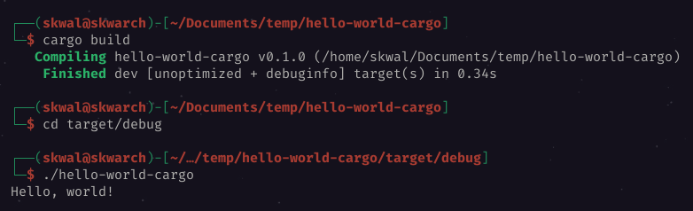
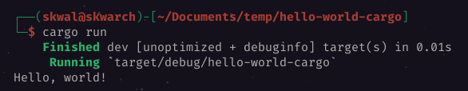

# Sommaire📚

- [Qu'est-ce que cargo❓](#quest-ce-que-cargo)
- [Creer un projet🆕](#creer-un-projet)
- [Compiler et executer un programme🏃](#compiler-et-executer-un-programme)
  - [Juste compiler](#juste-compiler)
  - [Compiler et executer🏃](#compiler-et-executer)

# Hello world avec cargo🚢

## Qu'est-ce que cargo❓

Cargo est un **gestionnaire de paquets Rust**. Il est utilisé pour gérer les dépendances et les projets Rust.

## Creer un projet🆕

Nous allons créer un projet appelé `hello-world-cargo`, pour faire ca nous allons utiliser la commande suivante:

```bash
$ cargo new hello-world-cargo --bin

> Created binary (application) `hello-world-cargo` package.
```

> ℹ️ l'option `--bin` permet de specifier que notre project est une application et non un module.

Cette commande a créé un nouveau dossier `📂 hello-world-cargo` dans le répertoire courant. Ce dossier contient un fichier `📄 Cargo.toml`, un dossier `📂 src` et un fichier `📄 main.rs`.

```
hello-world-cargo
├── Cargo.toml
├── .git
│   └── ...
├── .gitignore
└── src
    └── main.rs
```

Elle a egalament initialisé un repo git pour le projet.

Le dossier `📂 src` contient le code de l'application, il y a deja un fichier `📄 main.rs` a l'interieur qui contient un programme `hello-world`

```rust
// 📄 src/main.rs
fn main() {
    println!("Hello, world 👋");
}
```

| fichier        | description                                                                            |
| -------------- | -------------------------------------------------------------------------------------- |
| `📄 Cargo.toml` | le fichier de configuration du projet                                                  |
| `📂 src`        | le dossier contenant le code de l'application                                          |
| `📄 main.rs`    | le fichier contenant le programme `hello-world`                                        |
| `📂 .git`       | le dossier contenant les fichier git, vous pouvez l'ignorer si vous n'utilisez pas git |
| `📄 .gitignore` | le fichier contenant les fichiers à ignorer lors des commits                           |


## Compiler et executer un programme🏃

### Juste compiler

Pour compiler le programme, nous allons utiliser la commande `cargo build`.

```bash
# hello-world-cargo 📂
$ cargo build
```

Cette commande a créé un fichier exécutable `📄 hello-world-cargo` dans le répertoire `📂 target/debug`.

```bash
# hello-world-cargo/target/debug 📂
$ ./hello-world-cargo
> Hello, world 👋
```



### Compiler et executer🏃

Pour compiler et executer le programme, nous allons utiliser la commande `cargo run`.

```bash
# hello-world-cargo 📂
$ cargo run
...
> Hello, world 👋
```



---

<p align="right"><a href="https://skwalexe.github.io/apprendre-rust/">Accueil 🏠</a> - <a href="../les-variables">Section suivante ⏭️</a></p>

---

<p align="right">Cours créé par <a href="https://github.com/SkwalExe/" target="_blank">SkwalExe</a></p>