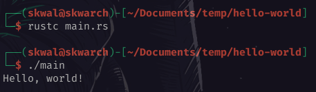

# Sommaire📚

- [Declarer une fonction](#declarer-une-fonction)
- [Afficher un message💬](#afficher-un-message)
- [Compiler et executer un programme🏃‍](#compiler-et-executer-un-programme)

# Hello world👋

## Declarer une fonction

Nous allons démarrer ce cours en créant un programme `hello-world`, en Rust 🦀.

Nous allons commencer par créer un dossier `📂 hello-world` dans lequel nous allons créer le fichier `📄 main.rs`:

> ℹ️ `.rs` est l'extension pour les fichier Rust.

Nous pouvons maintenant ouvrir le fichier `📄 main.rs` dans notre IDE, ainsi que d'un terminal de votre choix, et commencer à écrire notre programme.

On déclare une fonction appelée `main` car tous les programmes Rust commencent par une fonction `main`.

```rust
// 📄 main.rs
fn main() {

}
```

> ℹ️ `fn` : déclare une fonction.

> ℹ️ Les lignes commençant par `//` sont des commentaires, ils sont ignorés lors de l'exécution du programme.

## Afficher un message💬

Dans la fonction, nous allons appeler la macro `println!` pour afficher un message dans la console. Et nous passons la chaîne de caractères `Hello, world!` en argument.

```rust
// 📄 main.rs
fn main() {
    println!("Hello, world 👋");
}
```

> ℹ️ Toutes les instructions se terminent par un point-virgule `;`

## Compiler et executer un programme🏃‍

Maintenant que nous avons écrit notre programme, nous allons le compiler et l'exécuter.

Pour compiler le programme, nous pouvons utiliser la commande `rustc` suivi du nom du fichier a compiler:

```bash
$ rustc main.rs
```

> ℹ️ `$` : command

Exectuer cette commande créé un fichier exécutable nommé `📄 main` dans le répertoire courant que nous pouvons exécuter en tapant `./main`.

```bash
$ ./main
> Hello, world 👋
```

> ℹ️ `>` : Output de la commande



---

<p align="right"><a href="../hello-world-cargo">Section suivante ⏭️</a></p>

---

<p align="right">Cours créé par <a href="https://github.com/SkwalExe/" target="_blank">SkwalExe</a></p>