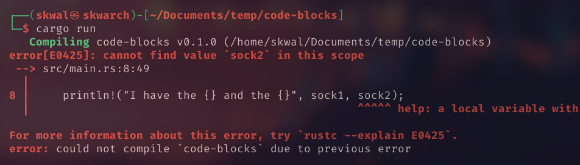

# Sommaire📚
- [Qu'est ce qu'un bloc de code ❓](#quest-ce-quun-bloc-de-code)
- [Usage](#usage)

# Les blocs de code🟪
## Qu'est ce qu'un bloc de code❓
Un bloc de code est un morceau de code qui est entouré de accolades `{}` qui est en quelque sorte isolé du reste du code, mais qui a quand meme acces aux variables et fonctions depuis l'exterieur du bloc.
## Usage 
Par exemple nous allons utiliser un bloc de code pour afficher une variable:
```rust
let chausette1 = "Premiere chausette 🧦";

{
    let chausette2 = "Deuxieme chausette 🧦";
    println!("J'ai la {} et la {}", chausette1, chausette2);
}
```
Output:
```
J'ai la Premiere chausette 🧦 et la Deuxieme chausette 🧦
```

Tout fonctionne comme attendu, mais maintenant, essayons d'afficher une variable en dehors du bloc de code:
```rust
let chausette1 = "Premiere chausette 🧦";

{
    let chausette2 = "Deuxieme chausette 🧦";
}

println!("J'ai la {} et la {}", chausette1, chausette2);
```
Sortie:



Nous obtenons l'erreur suivante parce que `chausette2` n'est pas defini en dehors du bloc de code.

Donc la deuxieme chausette disparait quand le bloc de code est terminé.

<!--

---

<p align="right"><a href="https://github.com/SkwalExe/apprendre-rust/tree/main/cours/les-blocs-de-code">Section suivante ⏭️</a></p>
-->

---


<p align="right">Cours créé par <a href="https://github.com/SkwalExe/" target="_blank">SkwalExe</a></p>