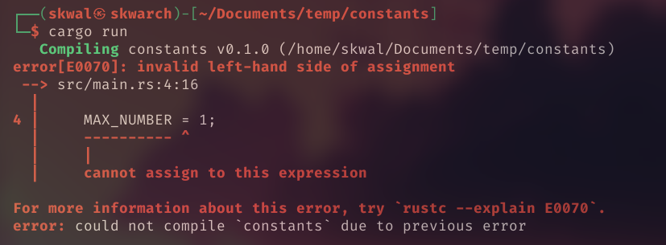

# Sommaire

- [Qu'est-ce qu'une constante❓](#quest-ce-quune-constante)
- [Declarer une constante](#declarer-une-constante)
- [Utiliser une constante](#utiliser-une-constante)

# Les constantes

## Qu'est-ce qu'une constante❓

Une constante est comme une variable qui ne peut pas être modifiée.

## Declarer une constante

Une constante peut être déclarée avec le mot-clé `const`, suivi du nom de la constante, **le type**, et ensuite de la valeur de la constante. **Le type de la constante doit être spécifié.**

> ℹ️ Le nom de la constante est conventionnellement capitalisé, pour savoir qu'il s'agit d'une constante.

Exemple:
```rust
const TVA: u8 = 20;
```

> ℹ️ Nous utilisons le type `u8` pour représenter un entier non signé 8 bits, car `u8` peut contenir des valeurs entre 0 et 255 et la TVA sera toujours dans cette plage. Il est un bon pratique d'utiliser uniquement le type de données le plus petit possible, ce qui rend votre code plus performant.

## Utiliser une constante

Nous pouvons maintenant utiliser la constante dans notre code.
Exemple, afficher des nombres de 1 à 10:

```rust
const MAX_NUMBER: u8 = 10;

fn main() {
    for i in 1..MAX_NUMBER {
        println!("{}", i);
    }
}
```

> ℹ️ Les constantes doivent être déclarées hors de la fonction principale.

Sortie:

```
1
2
3
4
5
6
7
8
9
```

Parce que nous utilisons une constante, nous ne pouvons pas la modifier, si nous la modifions, nous obtiendrons l'erreur suivante:



---

<p align="right"><a href="https://skwalexe.github.io/apprendre-rust/">Accueil 🏠</a> - <a href="../les-tuples">Section suivante ⏭️</a></p>

---

<p align="right">Cours créé par <a href="https://github.com/SkwalExe/" target="_blank">SkwalExe</a></p>