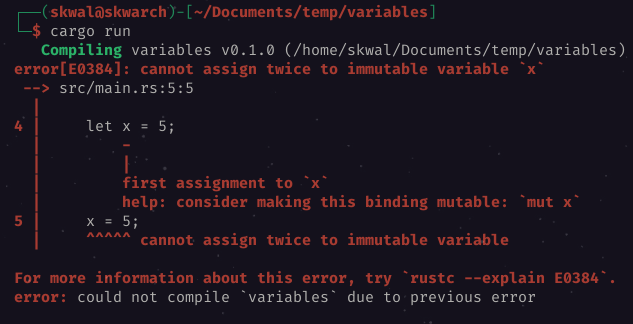

# Sommaire📚
- [Déclarer une variable](#declarer-une-variable)
- [Afficher une variable 💬](#afficher-une-variable)
- [Modifier une variable](#modifier-une-variable)
- [Les variables mutables](#les-variables-mutable)

# Les variables📦
## Declarer une variable
Pour déclarer une variable, on utilise le mot clé `let` suivi du nom de la variable, du signe `=` et de la valeur de la variable.

```rust
let x = 5;
```

Nous avons maintenant une variable  `x` avec pour valeur `5`.
## Afficher une variable💬
Nous pouvons maintenant utiliser la variable `x` dans notre programme, par exemple, pour l'afficher:

```rust
let x = 5;
println!("La valeur de x est : {}", x);
```

`{}` est un placeholder pour la valeur de `x`. Il sera remplacé par sa valeur lors de l'exécution du programme.
Si nous exécutons le programme, nous obtenons la sortie suivante:
```
La valeur de x est : 5
```

Le programme fonctionne comme si nous avions écrit:
```rust
println!("La valeur de x est : {}", 5);
```
parce que `x` est remplacé par sa valeur.
## Modifier une variable
Nous pouvons modifier la valeur d'une variable en utilisant la syntaxe suivante:

```rust 
// déclaration de la variable
let x = 5;
// modification de la variable
x = 6;
```

Mais si nous exécutons le programme, nous obtenons l'erreur suivante:


Nous obtenons cette erreur car par défaut, les variables sont immutables. Cela signifie que nous ne pouvons pas modifier leur valeur.

## Les variables mutables
Nous pouvons définir une variable comme mutable en utilisant le mot clé `mut` avant le nom de la variable.

```rust
let mut x = 5;
x = 6;
println!("La valeur de x est : {}", x);
```

Sortie:
```
La valeur de x est : 6
```

*Et c'est comme ca que l'on déclare des variables en rust !*


---

<p align="right"><a href="https://github.com/SkwalExe/apprendre-rust/tree/main/cours/les-types-de-donnees">Section suivante ⏭️</a></p>

---


<p align="right">Cours créé par <a href="https://github.com/SkwalExe/" target="_blank">SkwalExe</a></p>