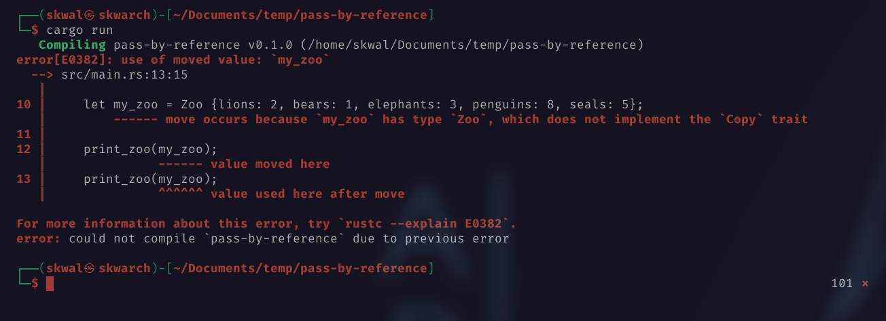

# Sommaire📚


# Passage par référence 🖇️
## Le probleme❌
Essayons de créer une fonction qui prend un argument.

```rust
struct Zoo {
    lions: u8,
    ours: u8,
    elephants: u8,
    pingouins: u8,
    phoques: u8,
}

fn main() {
    let my_zoo = Zoo {lions: 2, ours: 1, elephants: 3, pingouins: 8, phoques: 5};

    print_zoo(my_zoo);
}

fn print_zoo(zoo: Zoo) {
    println!("🐯 {}", zoo.lions);
    println!("🐻 {}", zoo.ours);
    println!("🐘 {}", zoo.elephants);
    println!("🐧 {}", zoo.pingouins);
    println!("🦭 {}", zoo.phoques);
}
```
La fonction `print_zoo` prend un argument de type `Zoo`(`my_zoo`).

Le code fonctionne comme prévu.

Sortie:
```
🐯 2
🐻 1
🐘 3
🐧 8
🦭 5
```
Mais si nous essayons de l'appeler de nouveau:
```rust
print_zoo(my_zoo);
print_zoo(my_zoo);
```
Nous obtenons l'erreur suivante:



Simplement parce que lorsque nous appelons `print_zoo`, la variable `my_zoo` est transférée du contexte de la fonction principale vers le contexte de la fonction `print_zoo`.

## La solution💡
Nous pouvons résoudre ce problème en passant une référence à `my_zoo` au lieu de la variable elle-même lorsque nous appelons la fonction.

Nous aurons également a spécifier que la fonction attend une variable passée par une reference.

```rust
struct Zoo {
    ...
}

fn main() {
    let my_zoo = Zoo {lions: 2, ours: 1, elephants: 3, pingouins: 8, phoques: 5};

    print_zoo(&my_zoo);
    print_zoo(&my_zoo);
}

fn print_zoo(zoo: &Zoo) {
    ...
}
```
Sortie:
```
🐯 2
🐻 1
🐘 3
🐧 8
🦭 5
<------ Second appel de la fonction
🐯 2
🐻 1
🐘 3
🐧 8
🦭 5
```


<!--
---

<p align="right"><a href="https://github.com/SkwalExe/learn-rust/tree/main/course/les-arrays">Next Section ⏭️</a></p>
-->

---

<p align="right">Course created by <a href="https://github.com/SkwalExe/" target="_blank">SkwalExe</a> and inspired by <a href="https://www.youtube.com/watch?v=vOMJlQ5B-M0&list=PLVvjrrRCBy2JSHf9tGxGKJ-bYAN_uDCUL" target="_blank">Dcode</a></p>